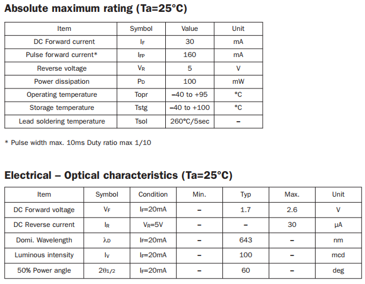
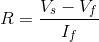
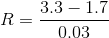

## Calculating resistors for LEDs

LEDs can be quite delicate. If you have too much current passing though them, then they are likely to **pop**. For this reason, you need to use a resistor with most LEDs to reduce the voltage going across them.

When you buy LEDs you can normally find a data-sheet for them like [this one](https://www.rapidonline.com/pdf/55-1792.pdf). In the data-sheet you will see a section like this:

The important values, to help you choose which resistor to use are the **Forward Voltage** and the **Forward Current** In the image above, the forward voltage is _1.7V_ and the forward current is _30mA_.

Now you can use ohm's law to calculate the resistor you need. Here is the formula you need to use.

Vs is the voltage supply. On a Raspberry Pi that is 3.3V
Vf is the forward voltage of the LED, in this case 1.7V
If is the forward current of the LED, in this case 0.03A (30mA/1000)

Put all these together:

you come to an answer of around 53Ω. So you need a resistor pretty close to this value. Much higher than this an your LED will appear dim. Much lower and you risk destroying the LED. In this case, the nearest resistor value you are likely to find is 56Ω. But anything between 56Ω and about 100Ω would be fine.
